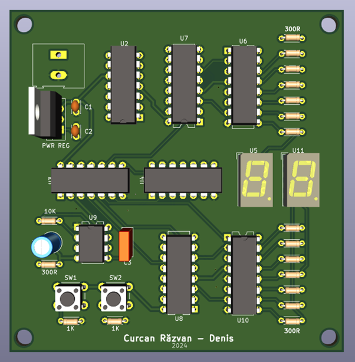
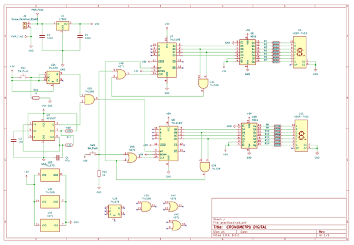
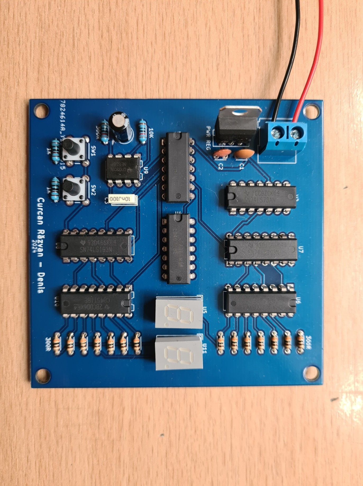
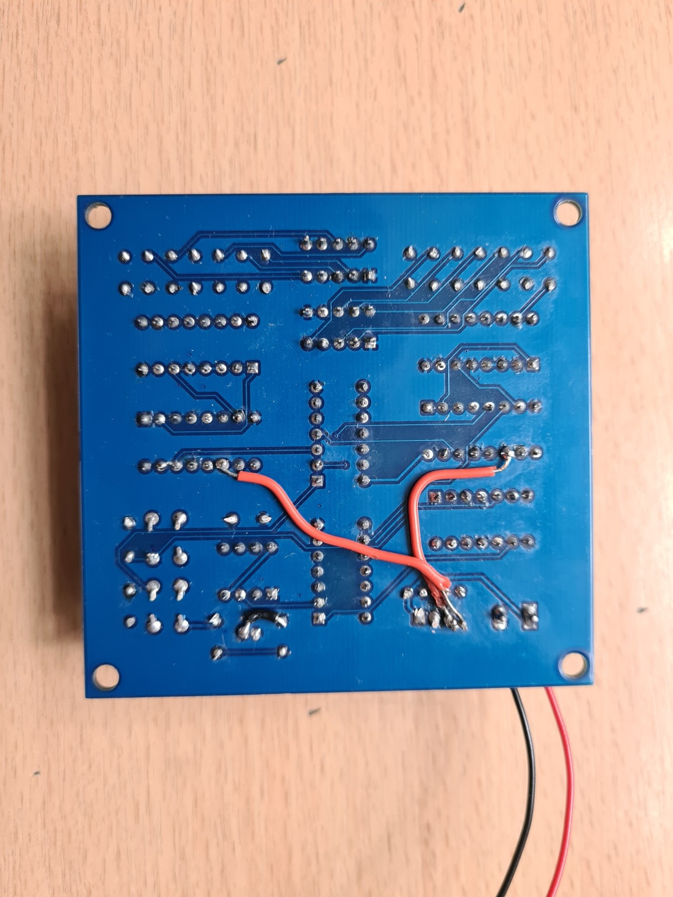

# Digital Timer - University Practice Project

This is the project I built for my 2nd-year university practice module. It is a digital timer designed in KiCad, capable of counting seconds (0-59) and displaying them on two 7-segment displays.

### Technical Overview

The circuit is designed with a modular approach:
1.  **Clock Signal:** Generated by an **NE555** timer configured as an astable oscillator.
2.  **Counting:** Handled by two **74LS193** 4-bit synchronous binary counters (U7 and U8).
3.  **Decoding & Display:** The binary signal is converted for the 7-segment displays using **CD4511** decoders.

**Logic Control:**
I used additional logic gates (**74LS73, 74LS08, CD4071**) to handle the counting limit (resetting at 60) and the Up/Down direction control.

### Schematic
Here is the final schematic, which includes the corrections needed for everything to work properly:

### v1.0 & Debugging

After getting the PCB manufactured and soldering the components, I spotted a mistake in the initial schematic: Pin 11 (Load) on the counters wasn't connected to 5V, and the C4 capacitor (47uF) wasn't linked to resistor R17.

**The Fix:**
I fixed this directly on the board by adding two jumper wires on the bottom layer.
* The red wires visible in the photo below connect the pins to 5V and route the capacitor correctly.
* With these changes, the circuit works perfectly.

| Top Layer (Components) | Bottom Layer (The Red Wire Fix) |
|:---:|:---:|
|  |  |

### Bill of Materials (BOM)

The total cost for the project (components + PCB + shipping) was approximately 140 Lei (~$30).

| Ref | Component | Description |
|:---|:---|:---|
| U9 | **NE555P** | Precision Timer |
| U7, U8 | **SN74LS193N** | Sync Binary Counter UP/DOWN |
| U6, U10 | **CD4511BE** | BCD to 7-Segment Decoder |
| U5, U11 | **HDSP-5601** | 7-Segment Display |
| U1 | **L7805** | 5V Voltage Regulator |
| U2 | **SN74LS73AN** | Dual JK Flip-Flop |
| U3 | **SN74LS08N** | Quad 2-Input AND Gate |
| U4 | **CD4071BE** | Quad 2-Input OR Gate |
| - | **9V Battery** | Power Source |

### Repository Structure
* `/kicad` - Source files (.sch, .kicad_pcb)
* `/img` - Images and renders
